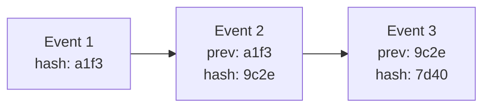
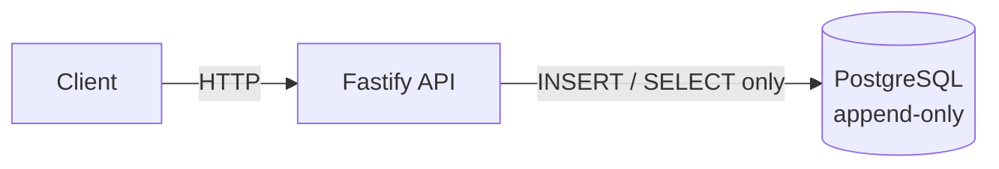

# Immutable Audit Log Engine

A tamper-evident audit logging service. Every event is chained to the
previous one with SHA-256, so altering history breaks the chain — and
`/verify` tells you exactly where.


## The problem

Regular logs can be edited or deleted by anyone with database access.
Someone changes a salary, then deletes the line that says they did it.
In finance, healthcare, or HR, that makes the log worthless as evidence —
if history can be rewritten, it proves nothing.

## How it works

Every event stores the hash of the event before it. Change any past row
and every hash after it stops matching — `/verify` walks the whole chain
and reports exactly which row broke.



That's the first layer. The second is at the database itself: `UPDATE`
and `DELETE` on `audit_log` are blocked by PostgreSQL triggers, not just
application code. Even direct DB access can't quietly edit a row.

## Features

- `POST /events` — append an event to the chain
- `GET /verify` — walk the chain, report if it's intact
- DB-level append-only (triggers reject UPDATE/DELETE)
- Advisory locking so concurrent writes can't fork the chain
- Zod validation on input, JSON schema validation on the API layer
- Swagger UI at `/docs`
- One command to run the whole thing with Docker

## Architecture



Two DB roles: `audit_app` (used by the API) can only `INSERT` and
`SELECT`. `audit_owner` is the only role that can touch the schema.

## Design decisions

- **Canonical JSON before hashing** — object keys get sorted first, so
  the same data always hashes the same way regardless of key order.
- **Advisory lock on write** — `pg_advisory_xact_lock` before reading the
  last hash, so two inserts at the same time can't both build off the
  same "previous" row and fork the chain. Covered by a test that fires
  concurrent writes and checks the chain still verifies.
- **What goes into the hash** — `seq`, `id`, `ts`, `actor`, `action`,
  `resource`, `payload`, `prev_hash`. Anything left out could be changed
  without detection.
- **Two roles instead of one** — a bug in the app can't accidentally
  bypass append-only, because the app's DB user physically can't run
  UPDATE or DELETE.

## Limitations

This is the part people skip and shouldn't.

- **A full rewrite is still possible.** If someone has complete control
  of the database, they could recompute every hash from a tampered point
  forward and the chain would look valid again. This system makes
  tampering *evident*, not *impossible*. Closing that gap needs external
  anchoring — publishing the latest hash somewhere outside the DB
  periodically, or signing it. Not implemented here; see Roadmap.
- **No auth, no rate limiting.** Anyone who can reach the API can insert
  events. Fine for a demo, not fine for production without putting it
  behind auth and a rate limiter first.
- **Nothing can ever be deleted.** By design. That's the whole point —
  but it also means there's no way to honor a data-deletion request
  (GDPR-style) on anything already written. Think carefully about what
  goes in `payload` before using this for real data.

## Quick start

```bash
git clone git@github.com:shmueldevCode/immutable-audit-log.git
cd immutable-audit-log
docker compose up -d --build
```

API's up at `http://localhost:3000`. Docs at `http://localhost:3000/docs`.

## API

**Append an event**

```bash
curl -X POST localhost:3000/events \
  -H 'content-type: application/json' \
  -d '{
    "actor": "maria",
    "action": "UPDATE_SALARY",
    "resource": "employee:42",
    "payload": { "from": 1000, "to": 1500 }
  }'
```

```json
{ "seq": 1, "hash": "ec416a4c45bf5ff3a0b1b9c3e158aee2b606105e4cffea8299a3a493a8c478be" }
```

**Verify the chain**

```bash
curl localhost:3000/verify
```

```json
{ "valid": true, "checked": 1 }
```

## Tamper detection, for real

This is the whole point of the project, so here's the actual attack
simulated end to end. Acting as someone with direct DB access, bypassing
the trigger, and editing a row by hand:

```bash
docker compose exec db psql -U audit_owner -d audit -c "
ALTER TABLE audit_log DISABLE TRIGGER no_update_delete;
UPDATE audit_log SET actor = 'hacker' WHERE seq = 2;
ALTER TABLE audit_log ENABLE TRIGGER no_update_delete;"
```

```bash
curl localhost:3000/verify
```

```json
{ "valid": false, "brokenAt": 2, "reason": "hash mismatch" }
```

Row 2, exactly. Even with the trigger disabled and the row edited by
hand, the chain catches it and says where.

## Testing

```bash
npm test
```

- Chain stays valid on normal inserts
- Tampering gets caught, and the exact row is reported
- Concurrent inserts don't fork or corrupt the chain
- Bad input on `POST /events` gets rejected (missing fields, wrong types,
  empty strings)

Runs on every push via GitHub Actions.

## Benchmark

Measured locally, not on dedicated hardware — take these as ballpark:

| | |
|---|---|
| 1,000 events, 20 concurrent clients | 964 events/sec |
| 10,000 events, 20 concurrent clients | 1,282 events/sec |
| `/verify` over 11,000 rows | ~44ms |

Script's in `scripts/bench.mjs` if you want to run it yourself.

## Roadmap

- External anchoring or HMAC signing, to close the full-rewrite gap
- Auth + rate limiting
- Maybe: publish this as a reusable npm package instead of a standalone
  service

## License

MIT
