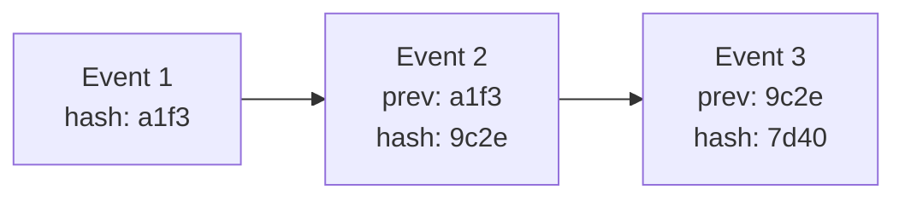
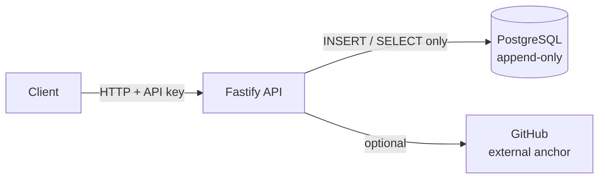

# Immutable Audit Log Engine

A tamper-evident audit logging service. Every event is chained to the
previous one with SHA-256, signed with HMAC, and optionally anchored
outside the database — so altering history is detectable even by
someone with full database access.


## The problem

Regular logs can be edited or deleted by anyone with database access.
Someone changes a salary, then deletes the line that says they did it.
In finance, healthcare, or HR, that makes the log worthless as evidence —
if history can be rewritten, it proves nothing.

## How it works

Every event stores the hash of the event before it. Change any past row
and every hash after it stops matching — `/verify` walks the chain
and reports exactly which row broke.



That's the first layer. The database itself enforces the second:
`UPDATE` and `DELETE` on `audit_log` are blocked by PostgreSQL triggers,
not just application code. Even direct DB access can't quietly edit a
row.

The third layer is HMAC: each event is also signed with a secret key
separate from the hash chain itself. Even someone who could recompute
the entire hash chain from scratch (given full DB control) can't forge
a valid HMAC without knowing the secret.

The fourth layer, optional, is external anchoring: the latest hash can
be published as a GitHub commit outside the database. Commits are
immutable once pushed, so this catches the one scenario the other three
layers can't: an attacker with full control of both the database *and*
the HMAC secret, rewriting everything consistently.

## Features

- `POST /events` — append an event to the chain, HMAC-signed
- `GET /verify` — check the chain's integrity (incremental by default,
  `?full=true` for a full re-check)
- `POST /anchor` — publish the latest hash to GitHub as an external,
  immutable anchor
- DB-level append-only (triggers reject UPDATE/DELETE)
- Advisory locking so concurrent writes can't fork the chain
- API key authentication, timing-safe comparison
- Rate limiting (100 req/min per API key)
- Zod + JSON schema validation on every input
- Swagger UI at `/docs`
- One command to run the whole thing with Docker

## Architecture



Two DB roles: `audit_app` (used by the API) can only `INSERT` and
`SELECT`. `audit_owner` is the only role that can touch the schema.

## Design decisions

- **Canonical JSON before hashing** — object keys get sorted first, so
  the same data always hashes the same way regardless of key order.
- **Advisory lock on write** — `pg_advisory_xact_lock` before reading the
  last hash, so two inserts at the same time can't both build off the
  same "previous" row and fork the chain. Covered by a test that fires
  concurrent writes and checks the chain still verifies.
- **What goes into the hash** — `seq`, `id`, `ts`, `actor`, `action`,
  `resource`, `payload`, `prev_hash`. Anything left out could be changed
  without detection.
- **HMAC signs the hash, not just the raw data** — so it also protects
  against someone recomputing the entire hash chain from scratch, not
  just against forging one event.
- **Incremental verification trusts checkpoints, on purpose** — `/verify`
  only re-checks rows added since the last checkpoint by default,
  instead of walking the whole table every time. This is a real
  trade-off, not a shortcut taken by accident — see Limitations.
- **Two DB roles instead of one** — a bug in the app can't accidentally
  bypass append-only, because the app's DB user physically can't run
  UPDATE or DELETE.

## Limitations

This is the part people skip and shouldn't.

- **Incremental verification has a real blind spot.** By default,
  `/verify` only checks rows added since the last checkpoint — it
  trusts that rows before the checkpoint are still fine. If someone
  tampers with a row that's already behind a checkpoint, incremental
  verification won't catch it. `GET /verify?full=true` always checks
  everything and will catch it. Run a full verification periodically if
  this matters to you (daily, weekly — whatever fits how much you
  trust the environment).
- **A full rewrite is still (theoretically) possible.** If someone has
  complete control of the database *and* knows the HMAC secret, they
  could recompute the entire chain — hashes and signatures — and it
  would look valid again. External anchoring (`POST /anchor`) closes
  this: the last hash published to GitHub can't be silently rewritten
  without it showing up as a commit history change, which is itself
  detectable. But anchoring only happens when you call it — it's not
  automatic yet.
- **Nothing can ever be deleted.** By design. That's the whole point —
  but it also means there's no way to honor a data-deletion request
  (GDPR-style) on anything already written. Think carefully about what
  goes in `payload` before using this for real data.
- **Rate limiting is per-process, not distributed.** If you ever run
  more than one instance of this API behind a load balancer, the 100
  req/min limit applies per instance, not globally. Fine for a single
  container; would need a shared store (Redis) at real scale.

## Quick start

```bash
git clone git@github.com:shmueldevCode/immutable-audit-log.git
cd immutable-audit-log
docker compose up -d --build
```

API's up at `http://localhost:3000`. Docs at `http://localhost:3000/docs`.

Every request to `/events`, `/verify`, and `/anchor` needs an
`x-api-key` header. Set your own in `docker-compose.yml` /
`.env` before running this for real — the ones checked into this repo's
history are development-only and already rotated out.

If something goes wrong after a previous failed attempt (leftover Docker
network, port conflict), clean up first:

```bash
docker compose down -v --remove-orphans
```

Then run `docker compose up -d --build` again.

## API

**Append an event**

```bash
curl -X POST localhost:3000/events \
  -H 'content-type: application/json' \
  -H 'x-api-key: YOUR_API_KEY' \
  -d '{
    "actor": "maria",
    "action": "UPDATE_SALARY",
    "resource": "employee:42",
    "payload": { "from": 1000, "to": 1500 }
  }'
```

```json
{ "seq": 1, "hash": "ec416a4c45bf5ff3a0b1b9c3e158aee2b606105e4cffea8299a3a493a8c478be" }
```

**Verify the chain (incremental)**

```bash
curl localhost:3000/verify -H 'x-api-key: YOUR_API_KEY'
```

```json
{ "valid": true, "checked": 1 }
```

**Verify the chain (full)**

```bash
curl "localhost:3000/verify?full=true" -H 'x-api-key: YOUR_API_KEY'
```

**Anchor the latest hash to GitHub**

```bash
curl -X POST localhost:3000/anchor -H 'x-api-key: YOUR_API_KEY'
```

```json
{
  "seq": 1,
  "hash": "ec416a4c...",
  "anchoredAt": "2026-09-22T19:29:35.557Z",
  "commitSha": "5dc4c85...",
  "commitUrl": "https://github.com/.../commit/5dc4c85..."
}
```

Requires a `GITHUB_TOKEN` with write access to this repo, set via `.env`
(see `.env` note in Quick start — never commit this file).

## Tamper detection, for real

This is the whole point of the project, so here's the actual attack
simulated end to end. Acting as someone with direct DB access, bypassing
the trigger, and editing a row by hand:

```bash
docker compose exec db psql -U audit_owner -d audit -c "
ALTER TABLE audit_log DISABLE TRIGGER no_update_delete;
UPDATE audit_log SET actor = 'hacker' WHERE seq = 2;
ALTER TABLE audit_log ENABLE TRIGGER no_update_delete;"
```

```bash
curl "localhost:3000/verify?full=true" -H 'x-api-key: YOUR_API_KEY'
```

```json
{ "valid": false, "brokenAt": 2, "reason": "hash mismatch" }
```

Row 2, exactly. Even with the trigger disabled and the row edited by
hand, the chain catches it and says where. (Using `?full=true` here on
purpose — see the incremental verification limitation above.)

## Testing

```bash
npm test
```

- Chain stays valid on normal inserts
- Tampering gets caught, and the exact row is reported (hash and HMAC
  mismatches both)
- Concurrent inserts don't fork or corrupt the chain
- Bad input on `POST /events` gets rejected (missing fields, wrong types,
  empty strings)
- Incremental verification only re-checks new rows, and creates/advances
  checkpoints correctly
- The incremental-vs-full trade-off is itself tested, not just assumed

Runs on every push via GitHub Actions.

## Benchmark

Measured locally, not on dedicated hardware — take these as ballpark:

| | |
|---|---|
| 1,000 events, 20 concurrent clients | 964 events/sec |
| 10,000 events, 20 concurrent clients | 1,282 events/sec |
| `/verify` (full) over 11,000 rows | ~44ms |

Script's in `scripts/bench.mjs` if you want to run it yourself. Note:
the incremental `/verify` is faster still on repeated calls since it
only re-checks new rows — the number above is for a full walk.

## Roadmap

- Merkle-tree-based verification, to close the incremental verification
  blind spot without paying the cost of a full walk
- Automatic (scheduled) anchoring instead of manual `POST /anchor` calls
- Distributed rate limiting (Redis) for multi-instance deployments
- Maybe: publish this as a reusable npm package instead of a standalone
  service

## License

MIT
